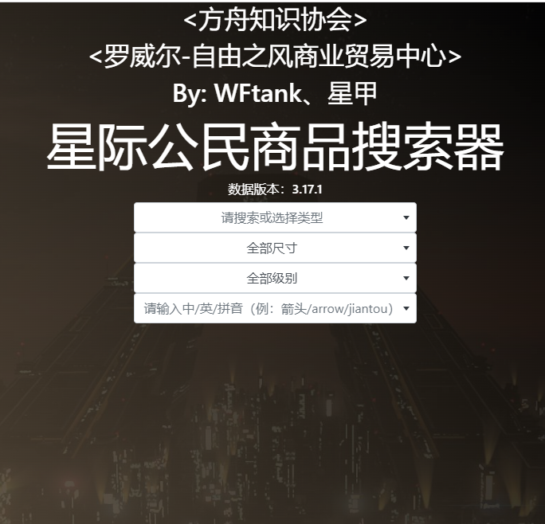

# 搜索器介绍及使用说明
地址：wftank.cn/search

## 网站干什么用的?
通过类型、尺寸、名称等快速定位物品的购买及出售地点，以及物品的属性介绍，可以查找游戏内可购买的所有东西（船、衣服、武器、配件、饮料食物、矿等等）。

## 特点
- 功能简单
- 中文，识字就能用

## 注意
当前版本游戏，如果某个东西被买光了，则物品会在购买终端中消失，并非数据不准。

## 怎么用？
如果你知道名字，直接点最后一行的下拉框，输入名称。
如果不知道名称，则根据第一行的分类下拉框选择所属分类后，再点击第四行的下拉框，则会筛选出对应分类的物品。
所有的下拉框都可以输入英文、中文或拼音。
## 例子
1. 拼音搜索小矿船

2. 找到S1，等级1的护盾(4个分别为军用、民用、隐身、竞速)

